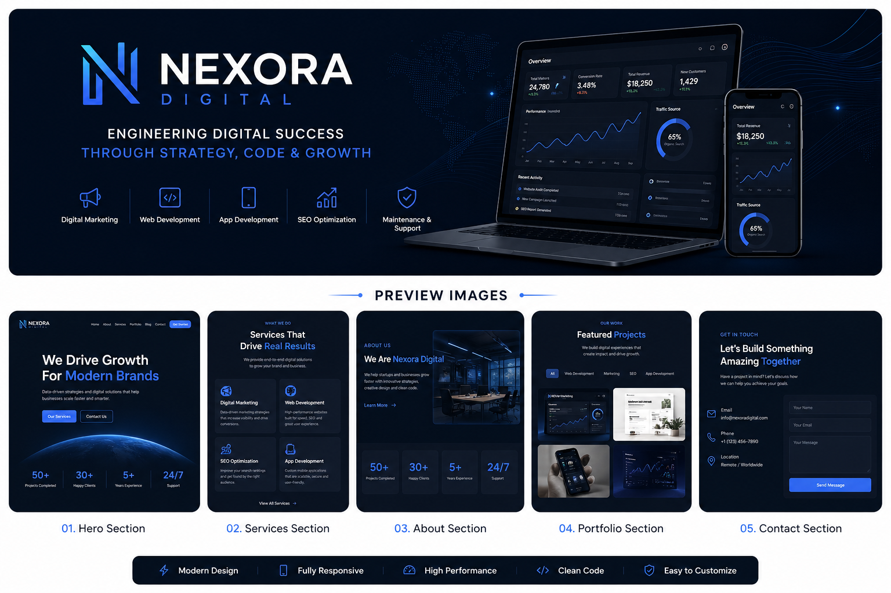

# 🚀 Nexora Digital — Official Website

**Nexora Digital** is a growth-driven digital agency focused on delivering high-performance marketing strategies and scalable digital solutions.

> *Engineering Digital Success Through Strategy, Code & Growth*

---

## 🧠 About Nexora

Nexora Digital blends **technology, creativity, and data-driven strategy** to help startups and modern brands scale faster.

🎯 Mission

To help businesses scale faster through **data-driven marketing and high-performance digital solutions.**

🌍 Vision

To become a globally recognized digital growth partner for startups and modern brands.

---

## 💼 Services

* 📈 Digital Marketing & Social Media Management
* 🌐 Website Development (High-performance & responsive)
* 📱 App Development
* 🔍 Search Engine Optimization (SEO)
* 🛠️ Website Maintenance & Optimization

---

## ⚙️ Tech Stack

* HTML5
* CSS3 (Custom Properties, Responsive Design)
* JavaScript (Vanilla JS)
* GSAP (Animations)
* AOS (Scroll Animations)
* Swiper.js
* Bootstrap 5

---

📌 Usage

This repository is intended for showcase and demonstration purposes only.

---

## ⚖️ License

> ⚠️ This project is proprietary and owned by Nexora Digital.
> Unauthorized use, reproduction, or distribution is strictly prohibited.

---

## 📬 Contact

📧 [phpword.dev@gmail.com](mailto:phpword.dev@gmail.com)
🌐 Website (coming soon)

---

⭐ Star this repo if you like the project!
